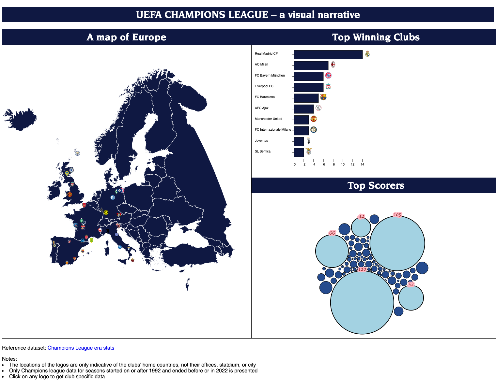
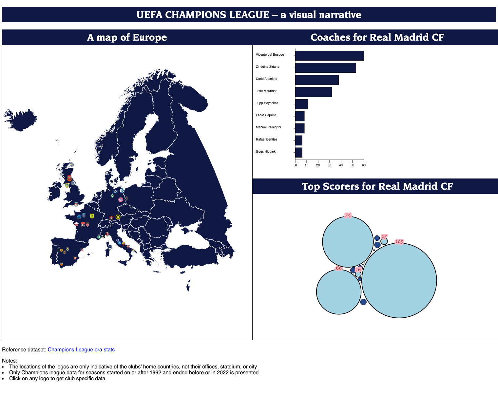

# Overview

Visualizations serve as powerful tools for conveying intricate data in a clear and accessible manner, and their utility is particularly evident in the context of football, a globally adored sport with billions of fans. The UEFA Champions League, as the pinnacle of football competition, harbors a trove of information, both contemporary and historical, that are effectively communicated in our visual representations as follows:

- Addressing the burgeoning demand for accessible information and comparative analysis, a proposed multilayer visualization of UEFA Champions League data aims to facilitate easy comparison of teams and players. This approach simplifies the comprehension of trends, patterns, and key insights, ensuring understanding of the competition and each team's history.

- By visually depicting UEFA Champions League data, one can explore historical trends and milestones, telling stories about a team's performance tracing the evolution of a player's career in the tournament. This storytelling element enhances audience engagement, captivating fans by providing a visually enriched journey through the tournament's rich history. The two levels of the [visualizations](#visualization) are displayed and further exaplained in the section below.

- First General View


  


- Second Team-Specific View (Filtered by Clicking on Real Madrid's Logo)


  

# Run Locally

To run this project on your local machine, follow these steps:

```bash
git clone https://github.com/mhendy25/info_vis.git
cd info_vis
npm install
npx webpack serve
```

If you got a cool idea, feel free to create a PR!


# Description of the data set and preprocessing:

We visualize a dataset composed of different tables about UEFA teams, countries, players, goals, and
coaches from 1992 to 2022 (34 seasons). The dataset contains data about the most performant 277
players, 39 coaches and 530 different European teams originating from 54 different countries. The tables
we utilize to derive our insights include AllTimeRankingByCountry.csv, CoachesAppearDetails.csv,
TopGoalScorer.csv, PlayerGoalDetails.csv from this [publicly available dataset on Kaggle](https://www.kaggle.com/datasets/basharalkuwaiti/champions-league-era-stats). The records in the tables have different numbers of attributes including but not limited to (Coach, Club, Season, Appearance, Titles,
Country, Win, Draw, Loss, Participated). The datatypes used varies depending on the view, but we focus on the number of goals (quantitative), coach names (categorical), countries (categorical), club names (categorical) and player names (categorical). 

With regards to data preprocessing, we use JavaScript and D3 on the fly to change the string datatype to integers for numerical attributes.

The data processing pipeline includes the following steps

+ Obtain the club logos of the top European clubs 
  For club logos, we scrape the data online, store it, and map it to its respective club as in `file_name_mapping_script.py` and `scrapper.py`.
+ Obtain the map of Europe
    we obtain a map of Europe and the border outlines of European countries in GEOJSON format. 
+ Match the clubs and the countries

   Additional steps were taken to match the clubs in the [dataset](https://www.kaggle.com/datasets/basharalkuwaiti/champions-league-era-stats) to the borders of the respective country in the GEOJSON data. Notably, an additional dataset of [FIFA country codes](https://gist.githubusercontent.com/danysigha/774a124bc279c56ed4323802dafd6445/raw/200692a0c0941e3c8086fb94e9a3436f131cd337/fifa_codes.csv) was necessary to map clubs to country names that match the GEOJSON. One limitation of the map is that the positon of club logos within countries is not representative of the real office/stadium location. Rather, club points were randomly generated within the borders of the relevant country. 


# Goals & Tasks

Throughout the visualization, we intend to:
- Provide a general overview about the competition, such as qualifying teams from each country, top winning teams, and historical top goal scorers.
  Using a map is appropriate because the central task focuses on understanding spatial relationships between data items. The area mark (club logos) is used in combination with the map. The color and shape channels (the color and shape of the logos) helps the user identify the clubs swiftly. 
  
- Provide a filter method to investigate team-specific data, such as managers and team-specific top goal scorers.
  We need multiple views to show different aspects of the [complex dataset](https://www.kaggle.com/datasets/basharalkuwaiti/champions-league-era-stats) and answer various questions from the audience. We use the Overview + detail approach to split the dataset into multiple views. One view shows the whole dataset, and two views show the subsets, giving the details of the data items.

  Interaction allows us to organize these views naturally and effectively. We use two of the three interaction levels: **primitive (mouse operations)** and **intermediate (view organization)**. The views are connected by some mouse operations (i.e click).
  
  When the user hovers over a club logo, tooltip information appears about the club. Clicking on the club updates the other views of the visualizaiton, sharing additional information about the dataset relevant to the club selected. 


# Visualization

we conceived a visualization interface with two levels. The first level is a map of Europe with the logos of top teams that participated in the competition between 1992 and 2022 centered in their respective countries. The second level is an array of two visualizations among which a horizontal bar chart, and a bubble chart to display teams’ titles earned data, players’ goal scoring data, and coach appearances data.

The three components are:

- Geomap:<br>
  It represents the coordinates and borders of each country, along with its randomly-placed teams. Users can click on the logos that appear on the map to update the information in the other views to data relevant to the selected club. 

- Barcharts:
  - First Visualization (no club selected):
    The barchart shows the top-10 winning teams.

  - Second Visualization (club selected):
    The barchart displays data about football managers that coached the most champions league games for the selected team.

- Bubble Chart:<br>
  - First Visualization (no club selected):
    It shows a dynamic force-directed graph where the bubbles are representative of the number goals scored by the top Champions League goal scorers **accross all clubs**.
  
  - Second Visualization (club selected):
    It shows a dynamic force-directed graph where the bubbles are representative of the number goals scored by the top Champions League **goal scorers of the selected club**.
  
    Hovering over the bubbles gives tooltip information about the player and the number of goals. 


# Reflection

The core idea of our visualization has not changed, although some details have not been implemented. First, we spent a significant amount of time gathering and preprocessing the data, including the Kaggle tables, European geomap, and team logos. Then, we ensured that Europe's borders are coherent and teams lie within their respective countries. After that, the barcharts and bubble charts were implemented separtely and then integrated in the visualization. Finally, we tested the visualization and included final additions like tooltips and labels. 

There are four changes that were made from the proposal. They were either due to issues of inefficient/inadequate design or lack of time and prioritization of other important features. 

+ One main change from our proposal is that we do not include players' faces in the bubble chart graph. This is because during implementation we didn't find it visually appealing. We had aspect ratio issues with the images. Furthermore, some players have very small bubbles, making it impossible to even recognize the player. Nevertheless, we did include tooltip information about the players, identifying their names and the number of goals scored. 

+ We do not aggregate the goals scored by top scorers accross teams. This is an issue we did not notice until close to submission. Moreover, we had more data pre-processing steps than we expected. We also faced more adversity than anticipated when implementing other features essential to the visualization like the central view with the map and logos.

+ We do not enlarge the club logos when the mouse hovers over them, nor do we include more than 34 club logos (although we scraped team logos for most Western European leagues) for the same reasons as above. We lacked the time to include all these features in the visualization and had to prioritize other aspects such as the tooltip and the map based view.

+ We changed the visual organization of the views because as we implementated it we realized that our initial design wasted a lot of space. 


# Next steps to improve the project:

+ In the default use case (no club selected) there is a need to aggregate the goals of top scorers accross different clubs. Currently this is not the case becuase of the nature of the dataset. This leads to a misleading visualization where Messi appears to have scored more Champions League goals than Ronaldo for example.

+ More club logos should be added on the map. The dataset has hundreds of clubs and the current visualization only shows 34 of them. A slider could also be added to let the user decide how many clubs them want to see.

+ The club logos overlap, leading to some club specific data being unaccessible. The force-directed graph appraoch we opted for should either be adapted or switched for another method that will prevent overlap. 

+ Although clubs are for the most part within the right country, there are still instances of clubs appearing in the middle of the ocean. The reason should be investigated, and perhaps using a different GEOJSON could fix the problem.

+ There is no adequate way to move from the "club selected" use case back to the default view. We currently have to reload the page. We need to implement the functionality to click once to select a club and click away to unselect it. 

